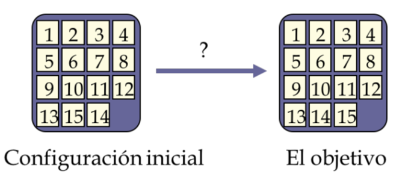
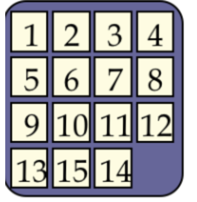

# Puzzle 15 

> Para el siguiente problema se plantea resolver un rompecabeza numerico donde se encuentra un espacio en blanco dento de una matriz de numeros de nxn desordenada y lo que se busca es ordenar de manera ascendente desde la esquina superior izquierda quedando de la siguiente manera




> Este algortimo esta divido en 2 grandes funciones una que consta de mover el espacio en blanco y la otra que validee que cada vez que movi el cuadro me este acercadno a encontrar la solucion del problema. Para esto se plantea preguntar si el espacio en blanco se puede mover en las 4 direcciones posibles, pero al mover el espacio en blanco puede que formemos puzzles que no nos daran la solucion correta por lo que se debe comparar con el objetivo para saber a donde nos dirigimos por lo que usando el algoritmo A* donde tenemos una funcion de coste. Cabe resaltar que un primer algoritmo es saber si el puzzle tiene solucion. A continuacion se explica con mas detalle el algoritmo

> La función de costos óptima para un algoritmo para 8 rompecabezas es: Suponemos que costará una unidad mover una ficha en cualquier dirección.

> A la luz de esto, creamos la siguiente función de costos para el algoritmo

> f(n) = g(n) + h(n)

> donde

> g(n) es la profundidad de camino en el arbol de decision y h(n) es la cantidad de fichas que no están en blanco que no están en su posición de meta final (fichas fuera de lugar).


## Configuracion 

> se debe agregar una lista de numero donde el espacio en blanco es un **0** asi para cada linea quedaria de la siguiente manera




> en lista quedaria [1,2,3,4,5,6,7,8,9,10,11,12,13,15,14,0] y como ejemplo se tiene la de las notas que ees [1,2,3,4, 5,6,0,8, 9,10,7,11 ,13,14,15,12] el g_n es la profundidad inical en este caso es 0 y el size_puzzle es el tamano de la matriz en este caso es 4 se deje este parametro apra matriz de 3x3 o 5x5 sea el caso

```jupyter
puzzle = [1,2,3,4,
          5,6,0,8,
          9,10,7,11
          ,13,14,15,12]
```